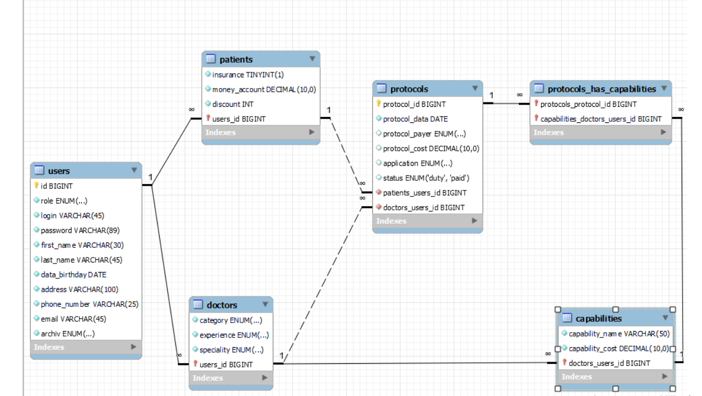

#  FINAL PROJECT SCHEME DATABASE - CLINIC FORESTMED
ForestMed Clinic is a web application through which patients can learn more about us. The patient can get basic information, as well as choose a doctor and a convenient day to visit the clinic. The administrator performs the main functions: registers doctors, new administrators, processes and creates requests for research protocols, makes changes to the data of doctors, patients, protocols.
The doctor has the opportunity to view the data of patients, the protocols performed by him.

Main Role project:  
#  _Admin role_
___
* Go to the "main" page
* Go to price page  
* Go to our doctors page  
* Go to about page  
* Change locale  
* Log In  
* Log out  

* View all user's  
-by id  
-by login  
-by first name  
-by last name  
-by email  

* Registration new Admin  
* Registration new Doctor 
* Registration new Protocol  

* View all doctor's  

* View doctor  
-by category  
-by experience  
-by speciality  

* View all patient's  

* View patient  
-by discount  
-by insurance  
-by login  

* View all protocol's  

* View protocol  
-by payer  
-by data  
-by doctor Id    
-by patient Id  
-by status  
-by application  

* Update doctor's  
  -category  
  -experience  
  -speciality

* Update patient's   
  -insurance  
  -discount  
  -money account

* Update protocol's  
-status  
-application  
-protocol cost  

* Take totalCost  
* Archiv doctor  
* Archiv patient  
* Archiv admin  
***    

_Patient role_  
---   
* Go to the "main" page  
* Go to price page  
* Go to our doctors page  
* Go to about page  
* Change locale  
* Log in  
* Log out  
* Registration  
* Choose doctor  
* Application protocol's  
* View all doctor's  
* View all patient's protocol  

_Doctor role_  
 --- 
* Go to the "main" page  
* Go to price page  
* Go to our doctors page  
* Go to about page  
* Change locale   
* Log in  
* Log out  
* View all patient's  
* View all doctor's protocol
***   

